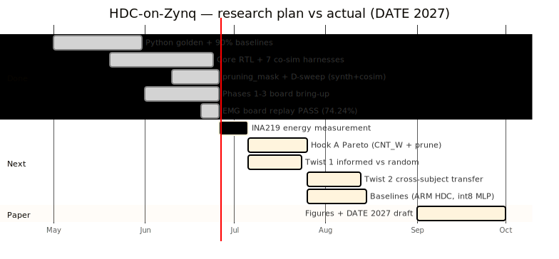

<!-- _class: lead -->
<!-- _paginate: false -->

# 1024-bit Hyperdimensional Computing Accelerator on Zynq-7020

## A streaming, bit-exact-verified HDC classifier for EMG hand-gesture recognition

Research progress review · Target venue: **DATE 2027**

Platform: Xilinx Zynq-7020 (ZedBoard) · SystemVerilog + Python golden reference

---

## The problem & motivation

- **Edge inference needs to be cheap and low-power** — wearables, prosthetics, IoT. Conventional CNN/MLP inference is multiply-heavy (needs DSP/GPU) and power-hungry.
- **Hyperdimensional Computing (HDC)** is a brain-inspired alternative: represent everything as long binary vectors and classify by *distance*. Operations are purely **bitwise** → ideal for FPGAs.
- **Application:** EMG hand-gesture recognition (same dataset as Rahimi et al., ICRC 2016), the standard HDC-on-EMG benchmark → enables direct comparison with literature.

**Thesis:** A streaming 1024-bit HDC core on Zynq can classify EMG at high throughput with **zero DSP / zero BRAM**, and per-bit pruning can cut energy further with controlled accuracy loss. The contribution is a measured **accuracy / energy / area Pareto**, not a re-port of prior accuracy.

---

## What is Hyperdimensional Computing?

- Every concept (sensor value, feature, class) → one **1024-bit hypervector**.
- In high dimensions, random vectors are **near-orthogonal** → huge capacity + noise tolerance (flipping a few bits barely changes identity).
- Classification = **nearest prototype by Hamming distance** — no floating point, no matrix multiply.
- Model used: **Binary Spatter Code (BSC)** — binary vectors, XOR binding, Hamming similarity. The most hardware-friendly HDC flavour.

**Why it suits FPGAs:** bitwise ops (XOR, shift, popcount) → cheap LUT logic, no multipliers. One-shot training (bundle examples once). Inherent error tolerance enables aggressive pruning / low voltage.

---

## The four HDC primitives

All of HDC is built from four operations — each is a verified RTL block here:

| Primitive | Math | Meaning | RTL block |
|-----------|------|---------|-----------|
| **Bind** | XOR (A ⊕ B) | Associate two concepts | `xor_permute_top` |
| **Permute** | cyclic shift ρ(A) | Encode position / order | `permute_stage` |
| **Bundle** | majority vote | Superpose into a "set" vector | `bundle_unit` |
| **Search** | argmin Hamming | Classify (nearest prototype) | `popcount_am` |

Encoding = **bind + permute + bundle** → builds the query hypervector. **Search** classifies it. Everything is XOR, shift, and popcount — no DSP.

---

## Application — EMG hand-gesture recognition

**Task:** recognise hand gestures from 4-channel forearm EMG signals → gesture-controlled prosthetics.

How an EMG window becomes a class:

1. Capture a short **window** of the 4 EMG channels.
2. Quantise per-channel features into **16 discrete levels**.
3. Look up each (channel, feature, value) in **item-memory** hypervector ROMs.
4. **Bind + permute + bundle** → one 1024-bit **query hypervector**.
5. **Masked Hamming** search vs the **5 class prototypes** → nearest wins.

**"Training" in HDC = bundling.** No gradient descent — just superpose all of a gesture's training windows into one prototype. Inference is a single nearest-neighbour search.

---

## System architecture — Zynq PS + PL

**PS** (ARM) streams EMG windows from DDR over **AXI-DMA**; the **PL** HDC core encodes + classifies and returns labels. Control via **AXI4-Lite**, data via **AXI4-Stream**.

---

## The encoding datapath

Research-plan **Eq. (3.1)**: a 4 channel × 5 feature grid (20 binds), position-permuted, bundled into the query HV. The new **`pruning_mask`** gates which bits count in the associative-memory distance.

---

## Module hierarchy

**New: `pruning_mask.sv` extracted as a dedicated module** (research-plan §5.3.3) — holds the D-bit mask and gates the Hamming distance, cutting dynamic energy ∝ prune ratio. Verified bit-exact (**129/129 checks PASS**).

---

## Computational microarchitecture — word-serial datapath

The 1024-bit HV is stored as **16 × 64-bit words**. The associative memory streams **one 64-bit word per cycle**: `XOR` query⊕prototype → `AND` mask word → **64-bit popcount** (LUT adder tree) → accumulate distance `d_k`. Loop 16 words per class, 8 classes, then `argmin`.

**Why word-serial?** A full 1024-bit popcount tree is large and timing-critical. Processing 64 bits/cycle reuses **one small popcount + one accumulator** → **0 DSP, 0 BRAM**, easy 100 MHz timing. The `pruning_mask` word simply zeros gated bits *before* popcount, so pruning directly removes switching activity.

---

## Cycle-level behaviour — AM FSM & latency

| Stage | RTL block | Cycles | Notes |
|-------|-----------|--------|-------|
| Encode (bind+permute+bundle) | `encoder_top` | ~N_PAIRS + 3 = **~23** | 1 (channel,feature) pair/cycle, 4×5 grid |
| Bundle majority | `bundle_unit` | combinational | 1024 saturating counters, width **CNT_W=6** |
| Classify (masked Hamming) | `popcount_am` | N_CLASS·(2·WORDS+1) = **264** | 8 classes × (16 words × 2 + compare) |
| **Per-window total** | core | **≈ 287 cycles** | ≈ 2.9 µs @ 100 MHz; pipelined across windows |

`CNT_W` (bundle counter width) and the **prune ratio** are the two micro-architectural knobs of Hook A — both change the datapath's switching/area without touching its structure.

---

## Verification — the Python golden reference

A **bit-exact Python model** (`hdc_ref.py`) is the single source of truth — it generates both stimulus *and* expected output, so RTL and reference cannot silently drift.

---

## Verification coverage — 7 + 1 harnesses, all bit-exact

| Co-sim harness | Cases | Proves |
|----------------|-------|--------|
| `run_cosim` | 1000 | XOR bind + permute datapath |
| `run_bundle_cosim` | 500 | Majority bundler |
| `run_am_cosim` | 500 | Masked Hamming AM + argmin |
| `run_encoder_cosim` | 500 | Full EMG window encode |
| `run_core_cosim` | 500 | End-to-end encode → classify |
| `run_core_axi_cosim` | 200 | AXI4-Lite programming sequence |
| `run_stream_cosim` | 200 | AXI4-Stream + back-pressure |
| `run_pruning_mask_cosim` | 64 | New pruning-mask module |

All PASS on both Questa and Vivado xsim (June 2026).

---

## Board results — three measurement paths, same core

74.24%

Board EMG accuracy

Δ 0.00%

Board vs golden (658k win)

~216k

windows / second

0 / 0

DSP / BRAM

| | Phase 1 — AXI-Lite | Phase 2 — DMA stream | Phase 3 — SG batch |
|--|--------------------|----------------------|--------------------|
| Golden test | 200/200 | 200/200 | 200/200 |
| Mean latency | 3 µs/win | 7 µs/win | ~4 µs/win (batch) |
| Throughput | ~333k/s (micro) | ~143k/s | **~216k/s** |
| WNS @ 100 MHz | +0.246 ns | +0.023 ns | **+0.111 ns** |

---

## Resource utilisation & the D-sweep June gap CLOSED

**Integrated (PS + DMA + core), post-route xc7z020:** 35,206 LUT (66.2%), 96.3% slices, **0 DSP, 0 BRAM**.

**OOC core-only D-sweep** (functional cosim PASS + synthesis, all D):

| D | Slice LUT | LUT util | WNS (ns) | Fmax (MHz) | Cosim |
|---|-----------|----------|----------|------------|-------|
| 256 | 7,331 | 13.8% | 1.669 | 120.0 | PASS |
| 512 | 14,422 | 27.1% | 1.452 | 117.0 | PASS |
| 1024 | 28,600 | 53.8% | 0.781 | 108.5 | PASS |
| 2048 | 59,261 | **111.4%** | 1.340 | 115.5 | PASS |

LUT scales ~linearly with D. **D=2048 exceeds device LUT budget → a reportable Pareto boundary.**

---

## EMG accuracy — the two-baseline story read carefully

We report **two numbers on purpose** — they answer different questions.

| Track | Where | Encoding | Accuracy | Role |
|-------|-------|----------|----------|------|
| Stage A — MAP | Python | Bipolar MAP, D=10k | 90.36% | Literal Rahimi parity (paper 90.8%) |
| Stage B — BSC | Python | 4-ch spatial records | 90.30% | Frozen literature baseline |
| **RTL encoder** | Python **+ board** | Eq. (3.1) 4×5 grid | 74.24% | **Verified deployment path** |

**Defense one-liner:** *"We reproduced ~90% in Python (matching Rahimi). The FPGA runs a different, bit-exact-verified encoder at 74.24%. The contribution is measured energy + informed-pruning Pareto on that verified path — not a second accuracy port."*

---

## Why 74% is not a weakness — six points

1. **We do reproduce ~90%** — Stage A 90.36% / Stage B 90.30%, committed in Python.
2. **74% is a *different* encoder**, not a worse one — Eq. (3.1) hardware grid vs Rahimi's spatial records.
3. **Verification fidelity is perfect** — board = golden to **Δ0.00% over 658,004 windows**.
4. **The contribution is a systems study** — throughput, latency, zero-DSP area, energy Pareto.
5. **Headline claims are *relative*** — pruning retention, informed-vs-random gap, transfer — 74 vs 90 is irrelevant to them.
6. **Reporting both is a credibility strength** — gap fully traced; honest, debugged pipeline.

---

## Research novelty — Hook A: 3-axis Pareto contribution

Prior FPGA-HDC prunes **dimension**. The under-explored axis is **which bits** to keep.

| Axis | Values | Mechanism | Status |
|------|--------|-----------|--------|
| Dimension **D** | 256 / 512 / 1024 / 2048 | parameterised RTL | DONE (synth+cosim) |
| Bundle precision **CNT_W** | 3 / 4 / 5 / 6 | majority-vote resolution | running (Python sweep) |
| **Bit-pruning ratio** | 0 / 50 / 75 / 87.5% | Fisher mask via `pruning_mask` | running (Python sweep) |

Map the **accuracy / energy / area** trade-off surface for HDC-on-FPGA. D-axis measured on silicon; the **64-cell `run_hook_a_sweep.py` grid** (D × CNT_W × prune) is running (quick-sanity PASS) — feeds accuracy; **INA219** adds the real energy axis.

---

## Research novelty — Twist 1 & Twist 2

### Twist 1 — informed vs random pruning (headline result)
At each prune ratio, compare a **Fisher-ratio mask** (keep most discriminative bits) vs a **random mask of identical density**.
**Claim:** informed beats random by **≥5 pp at iso-density** → *bit position matters, not just bit count.*

### Twist 2 — cross-subject mask transferability
Train the mask on some EMG subjects, deploy unchanged on held-out subjects.
**Either outcome publishable:** transfers (≤3 pp) → universal "bit-importance map"; fails → motivates on-device adaptation. (needs 36-subject export; currently 5)

---

## Comparison baselines — why HDC-on-PL accuracy done

Same **P-may2026** protocol (5 subjects, full TEST). Accuracy complete; energy pending INA219.

| Baseline | Accuracy | Latency / window | Status |
|----------|----------|------------------|--------|
| **PL DMA (this work)** | 74.24% (board) | **~4 µs** (batch) | Phase 3 PASS |
| **ARM-only HDC** (C, Cortex-A9) | 74.15% | **818 µs** (1,222 win/s) | 200/200 golden |
| **Tiny int8 MLP** (~5.8k params) | 93.01% fp / 92.99% int8 | — | full 5 subjects |
| AXI-Lite PL path | — | ~3 µs | Phase 1 |

**PL DMA is ~200× faster per window than ARM software** (4 µs vs 818 µs) at matched accuracy (74.24 vs 74.15%). The MLP shows a higher-accuracy NN reference; INA219 will add the **energy** column for the ~10× efficiency claim.

---

## Status & roadmap

Bring-up, all **June** RTL deliverables, **and the comparison baselines** are **complete and ahead of schedule**. Remaining: INA219 energy → finish Hook A sweep → twists → the paper.

---

## Summary & next steps

**Done & verified (on GitHub):**
- RTL datapath + 8 co-sim harnesses, bit-exact
- Phases 1–3 board bring-up; EMG replay 74.24%, Δ0.00% over 658k windows
- `pruning_mask.sv` extracted; D-sweep synth + cosim (256–2048)
- Python ~90% baselines reproduced
- Comparison baselines: ARM HDC (74.15%, 818 µs/win) + tiny int8 MLP (93.0%)

**Next (critical path):**
1. INA219 energy measurement (unblocks all Pareto/energy + ARM-vs-PL ~10× claim)
2. Hook A — `run_hook_a_sweep.py` grid (D × CNT_W × prune) running → board anchors
3. Twist 1 (informed vs random) — headline figure · Twist 2 (cross-subject)
4. Paper figures + DATE 2027 draft

---

<!-- _class: lead -->
<!-- _paginate: false -->

# Thank you

## Questions & discussion

The hardware is **done and provably correct** (bit-exact on 658k windows).
74% is a faithful hardware encoder — we already match ~90% in Python.
The **research** is the energy/accuracy Pareto + informed-pruning result.
